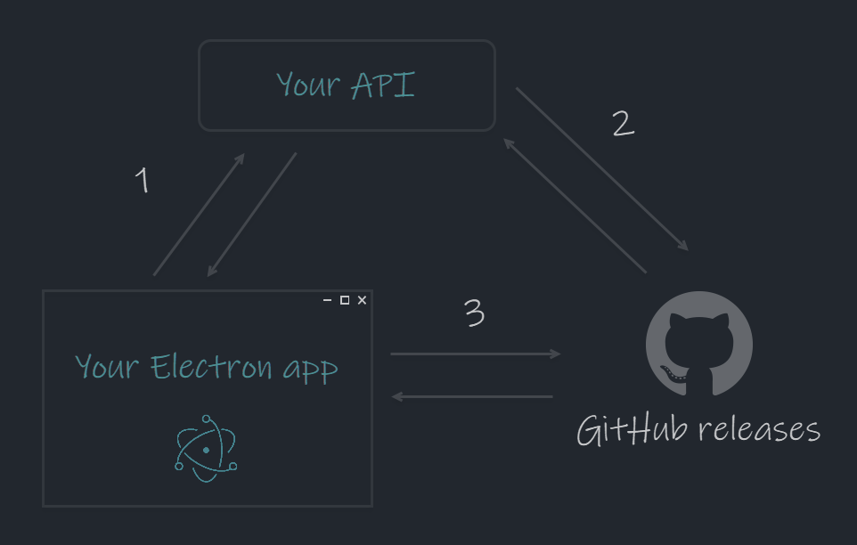

# Auto Update Electron App (Demo app)

This is a demo app to try out the functionality of [electron-auto-update-api](https://github.com/st-knot-software/electron-auto-update-api) to improve the workflow of auto updates for electron apps. This Electron app uses [electron-updater](https://www.npmjs.com/package/electron-updater) package to handle automatic updates, check out their [documentation](https://www.electron.build/auto-update.html) for more info about how updates are handled on the app/client side.

Also checkout this blog post to read more about the api, and why it could be a good idea to use. 📖



## Try it out 🚀

### 1. Setup & Configure Auto Update API

1. Clone/Fork this repo, whatever suites you. The repo you clone or fork to will host the releases of this demo.
2. Clone/Fork [electron-auto-update-api](https://github.com/st-knot-software/electron-auto-update-api) & configure it to use the repository created in step 1.

### 2. Setup & Configure Electron app to use the API

1. The following class exists within `./main/main.ts` and needs to be modified with the url to your API. Running the API locally with no changes to its launchSettings.json will default to url: https://localhost:5004.
2. If step 1.1 was cloned to a private repo, then the GitHub token also need to be specified.

```typescript
export default class Updater {
  constructor() {
    let updater: AppUpdater;

    const apiUrl = ''; // Specify the adress to your api.
    //const GHToken = ''; // Specify a github token if using private repository.

    const options: AllPublishOptions = {
      provider: 'generic',
      url: `${apiUrl}/update/${process.platform}/${app.getVersion()}`,
      requestHeaders: {
        //Authorization: `Bearer ${GHToken}`, Specify if using private repository.
        accept: 'application/octet-stream',
      },
    };

    if (process.platform === 'win32') {
      updater = new NsisUpdater(options);
    } else if (process.platform === 'darwin') {
      updater = new MacUpdater(options); // Note: OSX apps needs to be signed for auto updates to work.
    } else {
      updater = new AppImageUpdater(options);
    }

    updater.logger = log;
    updater.checkForUpdates();
  }
}
```

### 3. Build, install & auto update

1. Run: `npm run package`, this will produce an installer for version 1.0.0 of the app.
2. Install it, (the name of the installer will depend on current OS, for windows it will be `./release/build/auto-update-electron-app-win-1.0.0.exe` etc.)
3. Now there should be a version 1.0.0 installed on your PC looking for updates by requesting your API. Woho!🧨

Now lets build the next version...

1. Go to `./release/app/package.json` and bump up the version to 2.0.0.
2. Run `npm run package` to produce the newer version of the app.
3. Create a new release for your Github repository matching the version of your app and name the release v.2.0.0.
4. Upload release files: `auto-update-electron-app-win-2.0.0.exe`, `auto-update-electron-app-win-2.0.0.exe.blockmap` & `latest.yml` for windows, files will be named similiar for each platform. *(Note that auto updates for OSX needs to use .zip target and will not need a .blockmap)*
5. Publish the v2.0.0 release.

Time to update the app...

1. Make sure that your API is up and running on URL that provided in your Electron app configuration.
2. Start the installed version of your app *(should be version 1.0.0)*.
3. It should now automatically update to version 2.0.0.

## Notices

This project uses [electron-react-boilerplate](https://github.com/electron-react-boilerplate/electron-react-boilerplate) as a template, go check their project out to quickly get up an running with Electron & React.
